### `bruno@github ~ $ ./contributions.sh`

 

### `bruno@github ~ $ whoami`

<table><tr><td valign="top"></td><td valign="top"></td></tr></table>

 

Transformo regras de negócio em produtos web, APIs e automações que as pessoas conseguem usar — e que outros desenvolvedores conseguem manter.

Trabalho profissionalmente com software desde 2023. Gosto de entender o problema inteiro, simplificar o que parece confuso e entregar em passos pequenos, verificáveis e úteis.

 

[`LinkedIn`](https://www.linkedin.com/in/bruno-francio/) · [`E-mail`](mailto:brunofrancio@gmail.com) · [`Projetos públicos`](https://github.com/BrunoFrancio?tab=repositories)

